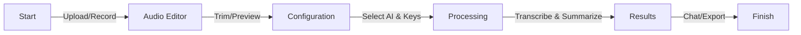

# Trammarise 🎙️

AI-powered audio transcription and summarization web application with multi-AI provider support and interactive chat capabilities.

## Quick Start ⚡

Get Trammarise running in 3 minutes!

### For Users

1. Visit the deployed app
2. Upload or record audio
3. When processing, you'll be prompted for:
   - Your preferred AI provider (ChatGPT, Claude, or Deepseek)
   - Your API key (get instructions in-app)

### For Developers

```bash
# Install dependencies
npm install
npm install -g vercel

# Start development server
vercel dev
```

Open [http://localhost:3000](http://localhost:3000)

**Note**: No environment variables needed - users provide API keys via UI

---

## ✨ Features

- 🎤 **Record or Upload** audio files
- 🌊 **Interactive Waveform** visualization
- ✂️ **Audio Trimming** - Select specific portions to process
- 🤖 **AI Transcription** - OpenAI Whisper speech-to-text
- 🔑 **Choose Your AI** - Select between ChatGPT, Claude, or Deepseek
- 📝 **Smart Summarization** - Context-aware AI summaries
- 💬 **Interactive Chat** - Refine summaries, ask questions, translate
- 🔊 **Text-to-Speech** - Read transcripts and summaries aloud
- 📋 **Copy to Clipboard** - Easy sharing

### User Flow



## 📋 Requirements & Specifications

For a detailed breakdown of functional requirements, user stories, and technical specifications, please see our [Functional Analysis](docs/functional-analysis/functional-analysis.md).

## 🚀 Tech Stack

- **React 19** - UI library
- **TypeScript** - Type safety
- **Vite** - Build tool and dev server
- **WaveSurfer.js** - Audio waveform visualization
- **OpenAI Whisper** - Universal transcription service
- **Multi-AI Support**:
  - ChatGPT (GPT-4)
  - Claude (3.5 Sonnet)
  - Deepseek
- **Vercel Serverless** - Secure API endpoints
- **React Markdown** - Formatted summary rendering

---

## 💡 Usage

### 1. Upload or Record Audio

Click "Start Recording" to record directly, or upload an audio file (MP3, WAV, WEBM, etc.)

### 2. Visualize and Edit

- View your audio as an interactive waveform
- Trim unwanted sections (click scissors icon, drag to select region)

### 3. Click "Process Audio"

### 4. Configure AI Settings

You'll be prompted to:

- Select **content type** (Meeting, Lecture, Interview, Podcast, Voice Memo, or Other)
- Choose **AI provider** (ChatGPT, Claude, or Deepseek)
- Enter your **API key(s)**
  - OpenAI key required for transcription (Whisper)
  - Provider key for summarization
- Click the help section for instructions on getting API keys

### 5. Wait for Processing

- **Transcription**: OpenAI Whisper converts speech to text
- **Summarization**: Your selected AI generates a structured summary

### 6. View Results

- Full transcript
- AI-generated summary with markdown formatting
- Interactive chat interface

### 7. Interactive Chat Examples

- "Make this summary shorter"
- "What are the main action items?"
- "Translate to Spanish"
- "Extract key dates and deadlines"

---

## 🔑 Getting API Keys

### OpenAI (Required for Transcription)

**Purpose**: Whisper transcription service (used by all providers)

1. Go to [https://platform.openai.com/api-keys](https://platform.openai.com/api-keys)
2. Click "Create new secret key"
3. Copy the key (starts with `sk-`)

**Cost**: ~$0.006 per minute of audio

**Note**: If using ChatGPT for summarization, this same key handles both transcription and summarization.

### ChatGPT (OpenAI GPT-4)

**Purpose**: Summarization and chat

- Uses the same OpenAI key from above
- **Model**: GPT-4
- **Cost**: ~$0.01-0.03 per summary, ~$0.01-0.02 per chat message

### Claude (Anthropic)

**Purpose**: Summarization and chat

1. Go to [https://console.anthropic.com/](https://console.anthropic.com/)
2. Create an account
3. Navigate to API Keys
4. Create a new key

- **Model**: Claude 3.5 Sonnet
- **Cost**: ~$3/$15 per million input/output tokens
- **Note**: Still requires OpenAI key for transcription

### Deepseek

**Purpose**: Summarization and chat (lower cost alternative)

1. Go to [https://platform.deepseek.com/](https://platform.deepseek.com/)
2. Create an account
3. Get your API key

- **Model**: Deepseek-chat
- **Cost**: Lower cost option (check platform for current rates)
- **Note**: Still requires OpenAI key for transcription

### Security Note

- Keys are stored only in your browser's sessionStorage
- Automatically cleared when you close the tab
- Never saved to disk or cloud
- Never exposed to our servers
- **Recommendation**: Set spending limits on your API keys for safety

---

## 👨‍💻 For Developers

### Installation

```bash
# Clone the repository
git clone <your-repo-url>
cd trammarise

# Install dependencies
npm install

# Install Vercel CLI (required for API routes)
npm install -g vercel

# Start development server
vercel dev
```

The app will be available at `http://localhost:3000`

### Architecture

**Provider Abstraction Pattern** - Multi-AI support using the Strategy Pattern:

```
api/providers/
├── base.ts         # AIProvider interface
├── factory.ts      # Provider factory
├── openai.ts       # ChatGPT (GPT-4) implementation
├── claude.ts       # Claude (3.5 Sonnet) implementation
└── deepseek.ts     # Deepseek implementation
```

**Key Interface**:

```typescript
export interface AIProvider {
  name: string;
  summarize(params: SummarizeParams): Promise<string>;
  chat(params: ChatParams): Promise<string>;
  validateApiKey(apiKey: string): Promise<boolean>;
}
```

### Project Structure

```
trammarise/
├── api/                          # Vercel serverless functions
│   ├── providers/               # AI provider implementations
│   │   ├── base.ts             # Provider interface
│   │   ├── factory.ts          # Provider factory
│   │   ├── openai.ts           # GPT-4 provider
│   │   ├── claude.ts           # Claude provider
│   │   └── deepseek.ts         # Deepseek provider
│   ├── transcribe.ts           # Whisper transcription endpoint
│   ├── summarize.ts            # AI summarization endpoint
│   ├── chat.ts                 # Interactive chat endpoint
│   └── validate-key.ts         # API key validation
│
├── src/
│   ├── components/
│   │   ├── states/             # Main app states
│   │   │   ├── InitialState.tsx
│   │   │   ├── RecordingState.tsx
│   │   │   ├── AudioState.tsx
│   │   │   ├── ConfigurationState.tsx  # AI provider selection
│   │   │   ├── ProcessingState.tsx
│   │   │   └── ResultsState.tsx
│   │   │
│   │   ├── forms/              # Form components
│   │   │   ├── ConfigurationForm.tsx   # AI config form
│   │   │   └── ApiKeyInfo.tsx          # API key help
│   │   │
│   │   ├── audio/              # Audio components
│   │   │   ├── WaveformPlayer.tsx
│   │   │   └── PlaybackControls.tsx
│   │   │
│   │   ├── results/            # Results UI
│   │   │   ├── ActionButtons.tsx
│   │   │   └── ChatInterface.tsx
│   │   │
│   │   ├── icons/              # SVG icons
│   │   └── ui/                 # Reusable UI
│   │       ├── Button.tsx
│   │       └── LoadingSpinner.tsx
│   │
│   ├── hooks/                  # Custom React hooks
│   │   ├── useAudioRecorder.ts
│   │   ├── useWaveSurfer.ts
│   │   └── useSpeechSynthesis.ts
│   │
│   ├── utils/                  # Utility functions
│   │   ├── api.ts              # API client
│   │   ├── audio.ts            # Audio utilities
│   │   └── session-storage.ts  # API key storage
│   │
│   └── types/                  # TypeScript types
│       └── audio.ts
│
├── docs/                       # Developer documentation
│   └── agent-workflow.md       # Internal development workflow
│
├── .env.example                # Environment template (optional)
├── vercel.json                 # Vercel configuration
└── package.json                # Dependencies
```

### Available Commands

```bash
vercel dev          # Start dev server with API routes (recommended)
npm run dev         # Start Vite dev server only (no API routes)
npm run build       # Build for production
npm run preview     # Preview production build
npm run lint        # Run ESLint
```

### Contributing

For internal development workflows and agent-based development patterns, see [docs/agent-workflow.md](docs/agent-workflow.md).

---

## 🚢 Deployment

### Deploy to Vercel (Recommended)

1. Push your code to GitHub
2. Import repository in [Vercel Dashboard](https://vercel.com)
3. Deploy!

**No environment variables needed** - users provide their own API keys through the application UI.

### Manual Deployment

```bash
vercel --prod
```

That's it! No configuration required.

---

## 💰 Cost Estimation

Based on current API pricing (as of 2025):

### OpenAI (ChatGPT)

- **Whisper**: ~$0.006/minute
- **GPT-4**: ~$0.01-0.03/summary
- **Chat**: ~$0.01-0.02/message
- **Total for 5min audio**: ~$0.04-0.08

### Claude (Anthropic)

- **Whisper** (OpenAI): ~$0.006/minute
- **Claude 3.5 Sonnet**: ~$3/$15 per million input/output tokens
- **Total for 5min audio**: ~$0.03-0.06

### Deepseek

- **Whisper** (OpenAI): ~$0.006/minute
- **Deepseek-chat**: Lower cost alternative
- Check [platform.deepseek.com](https://platform.deepseek.com/) for current rates

You control your own spending - set API spending limits for safety!

---

## 🔒 Security

- ✅ **API keys stored in browser sessionStorage only**
- ✅ **Automatically cleared when tab closes**
- ✅ **Never saved to disk or cloud**
- ✅ **Never sent to our servers** (only to AI provider APIs)
- ✅ **You control your own API spending limits**
- ⚠️ **Recommendation**: Set spending limits on your API keys

### For Users

Your API keys are secure and temporary. They:

- Only exist in your browser session
- Are cleared when you close the tab
- Go directly from your browser to the AI provider
- Are never logged or stored by us

### For Developers

Security best practices implemented:

- sessionStorage (not localStorage) for session-only storage
- No API keys in source code or environment variables
- CORS properly configured
- API keys never echoed in responses or logs
- Request timeouts implemented

---

## 🐛 Troubleshooting

### API Routes Return 404

**Problem**: `/api/*` endpoints not found

**Solution**: Use `vercel dev` instead of `npm run dev`. The Vercel CLI is required to run serverless functions locally.

### Transcription Fails

**Problem**: "Transcription failed" error

**Solutions**:

1. Verify your OpenAI API key is correct
2. Check OpenAI API quota and billing at [platform.openai.com](https://platform.openai.com/)
3. Ensure audio format is supported (webm, mp3, wav, etc.)
4. Check audio file isn't too large (limit: 25MB)

### Summarization Fails

**Problem**: "Summarization failed" after successful transcription

**Solutions**:

1. Verify you entered the correct API key for your chosen provider
2. Check your API provider account has credits/quota
3. Try a different AI provider

### Chat Not Working

**Problem**: Chat messages fail to send

**Solutions**:

1. Verify API key is valid
2. Check API provider account credits
3. Check browser console for specific errors

### API Key Validation Fails

**Problem**: "Invalid API key" message

**Solutions**:

1. Double-check you copied the entire key
2. Ensure no extra spaces before/after the key
3. Verify key is from the correct provider
4. Check key hasn't been revoked or expired
5. Try generating a new key

---

## 📚 Documentation

- [OpenAI API Docs](https://platform.openai.com/docs)
- [Anthropic API Docs](https://docs.anthropic.com/)
- [Deepseek Platform](https://platform.deepseek.com/)
- [Vercel Docs](https://vercel.com/docs)
- [WaveSurfer.js Docs](https://wavesurfer.xyz)
- [React Docs](https://react.dev)

---

## 📄 License

MIT

---

Built with ❤️ using React, TypeScript, and Multi-AI Providers

## React Compiler

The React Compiler is not enabled on this template because of its impact on dev & build performances. To add it, see [this documentation](https://react.dev/learn/react-compiler/installation).

## Expanding the ESLint Configuration

If you are developing a production application, we recommend updating the configuration to enable type-aware lint rules:

```js
export default defineConfig([
  globalIgnores(['dist']),
  {
    files: ['**/*.{ts,tsx}'],
    extends: [
      // Other configs...

      // Remove tseslint.configs.recommended and replace with this
      tseslint.configs.recommendedTypeChecked,
      // Alternatively, use this for stricter rules
      tseslint.configs.strictTypeChecked,
      // Optionally, add this for stylistic rules
      tseslint.configs.stylisticTypeChecked,

      // Other configs...
    ],
    languageOptions: {
      parserOptions: {
        project: ['./tsconfig.node.json', './tsconfig.app.json'],
        tsconfigRootDir: import.meta.dirname,
      },
      // other options...
    },
  },
]);
```

You can also install [eslint-plugin-react-x](https://github.com/Rel1cx/eslint-react/tree/main/packages/plugins/eslint-plugin-react-x) and [eslint-plugin-react-dom](https://github.com/Rel1cx/eslint-react/tree/main/packages/plugins/eslint-plugin-react-dom) for React-specific lint rules:

```js
// eslint.config.js
import reactX from 'eslint-plugin-react-x';
import reactDom from 'eslint-plugin-react-dom';

export default defineConfig([
  globalIgnores(['dist']),
  {
    files: ['**/*.{ts,tsx}'],
    extends: [
      // Other configs...
      // Enable lint rules for React
      reactX.configs['recommended-typescript'],
      // Enable lint rules for React DOM
      reactDom.configs.recommended,
    ],
    languageOptions: {
      parserOptions: {
        project: ['./tsconfig.node.json', './tsconfig.app.json'],
        tsconfigRootDir: import.meta.dirname,
      },
      // other options...
    },
  },
]);
```
