# Trammarise Architecture Diagrams

Visual representations of the design patterns and system architecture.

## System Overview

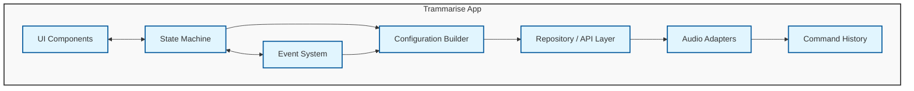

## Pattern Interactions

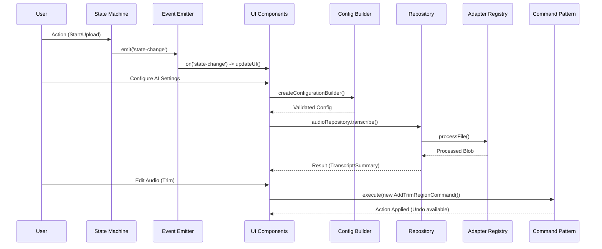

## State Machine Transitions

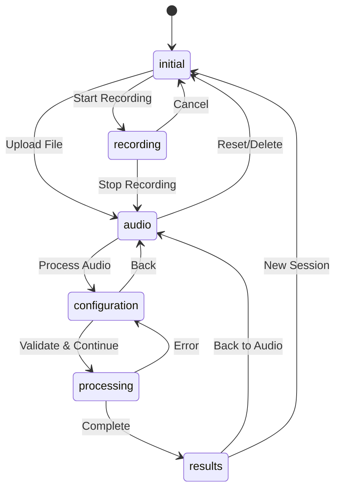

## Repository Pattern Flow

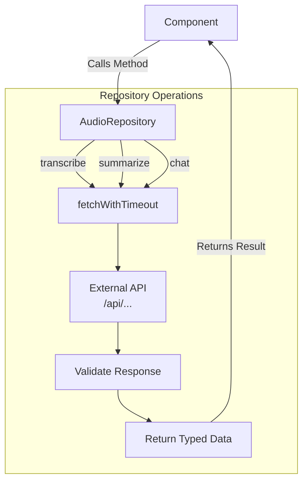

## Builder Pattern Flow

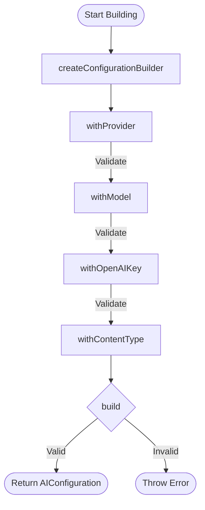

## Observer Pattern Flow

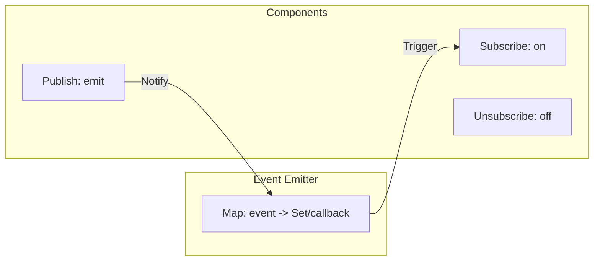

## Command Pattern Flow (Undo/Redo)

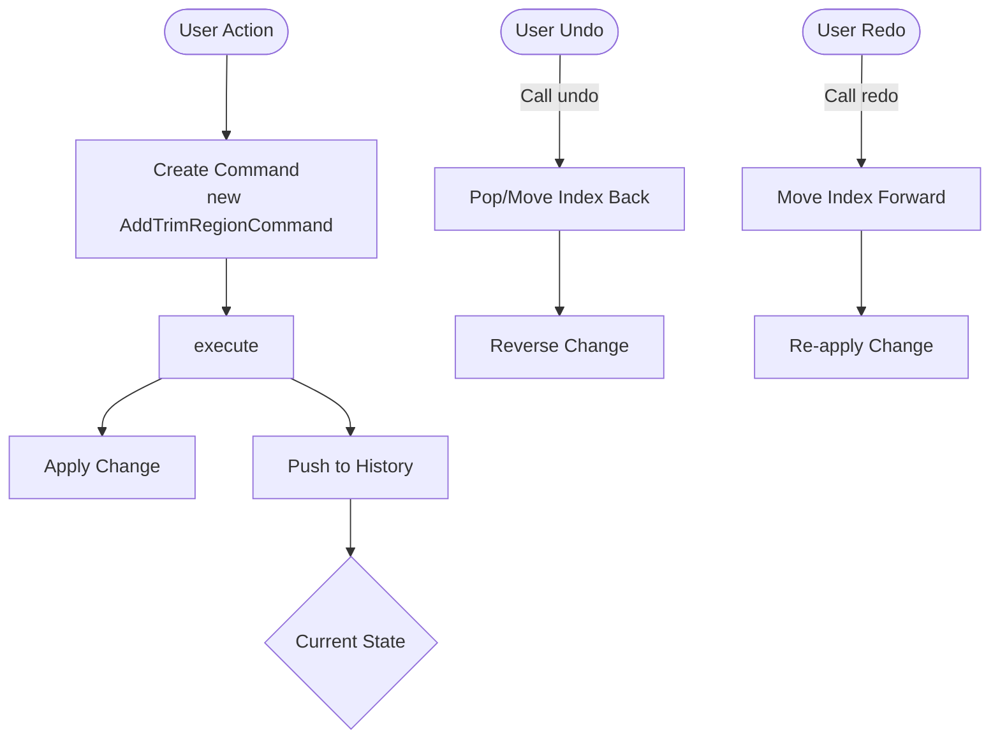

## Adapter Pattern Flow

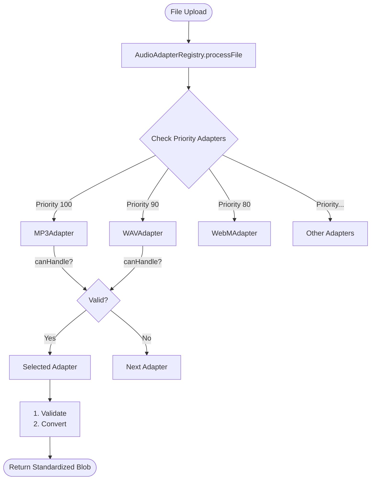

## Integration Example

```mermaid
job
    title Data Flow Integration

    section User Interaction
    Upload File: 1
    Configure AI: 2
    Click Process: 3
    Edit Audio: 8
    Undo/Redo: 9

    section Patterns
    Adapter Pattern: 1
    Builder Pattern: 2
    State Machine: 3, 7
    Observer Pattern: 4
    Repository Pattern: 5, 6
    Command Pattern: 8, 9

    section System
    Transcribe: 5
    Summarize: 6
    Show Results: 7
```

## Audio Storage Architecture

### Private Bucket Access Pattern

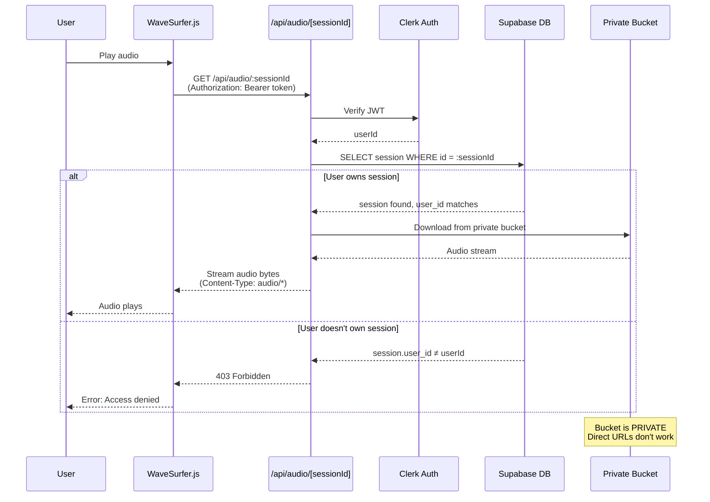

### Hybrid Storage Strategy

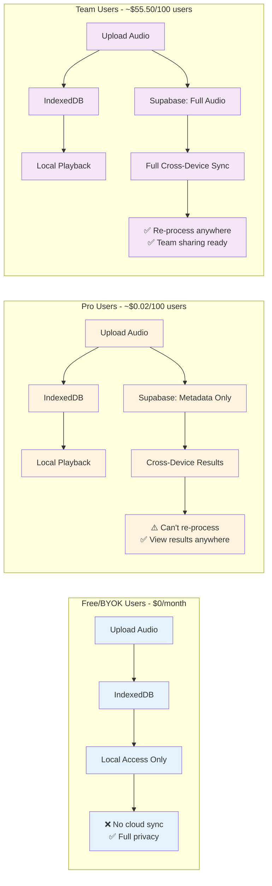

### Storage Decision Flow

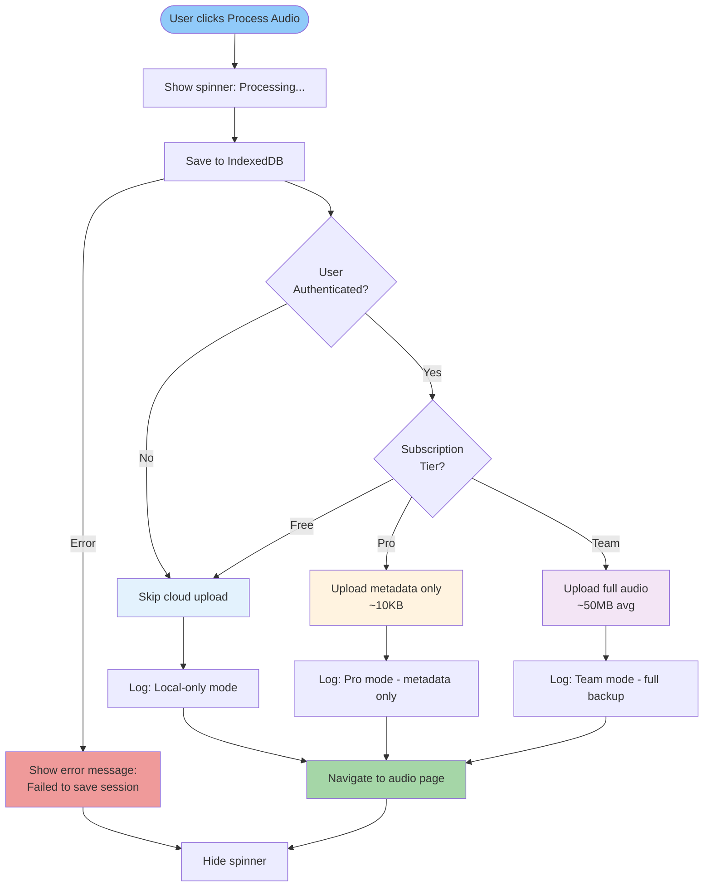

### Cost Optimization Model

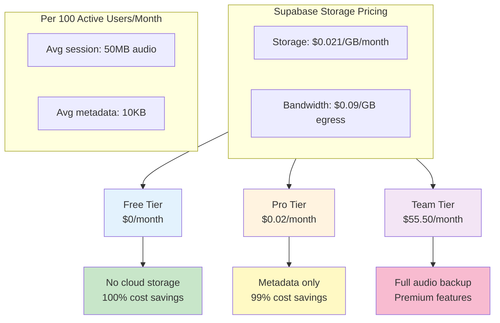

### Security Layers

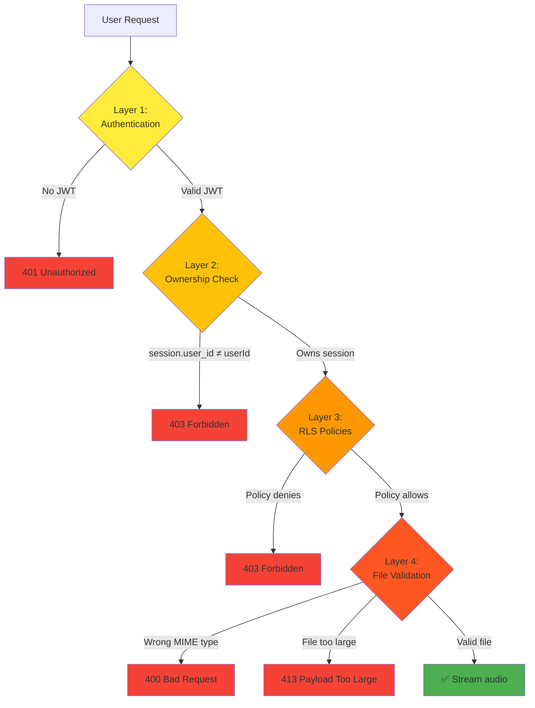

---

## Summary

All patterns work together to create a robust, maintainable architecture:

1. **State Machine** - Controls application flow
2. **Observer** - Communicates state changes
3. **Builder** - Creates valid configurations
4. **Repository** - Handles all API calls
5. **Adapter** - Processes different file formats
6. **Command** - Enables undo/redo
7. **Storage Strategy** - Optimizes costs while ensuring privacy

Each pattern has a specific responsibility and they interact seamlessly to provide a great developer experience.
