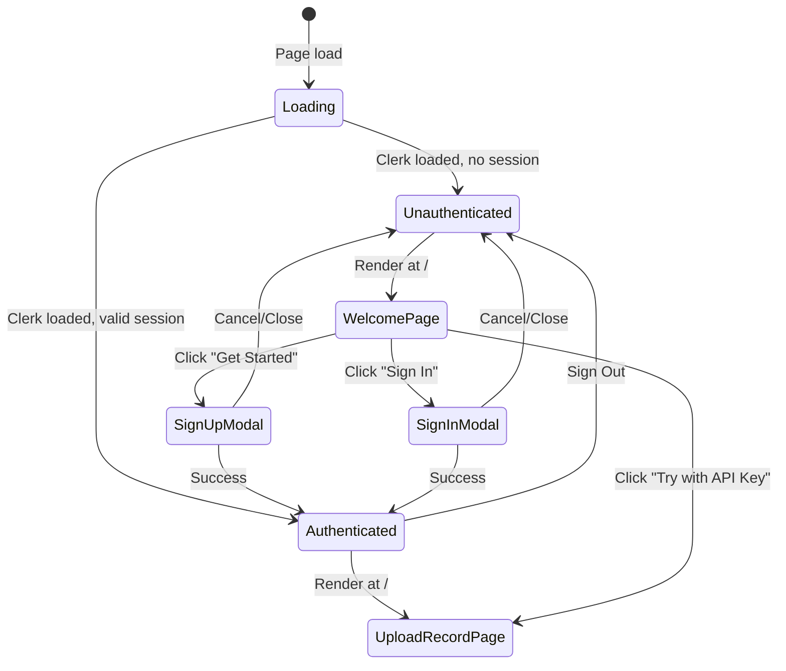

# Welcome Page Feature

**Feature:** Welcome / Landing Page for Unauthenticated Users
**Version:** 1.0
**Date:** February 10, 2026
**Status:** In Progress

---

## Table of Contents

1. [Business Requirements](#1-business-requirements)
2. [User Personas & Use Cases](#2-user-personas--use-cases)
3. [Functional Specifications](#3-functional-specifications)
4. [User Journey](#4-user-journey)
5. [Route Structure](#5-route-structure)
6. [Component Architecture](#6-component-architecture)
7. [Authentication Flow](#7-authentication-flow)
8. [Edge Cases & Error Scenarios](#8-edge-cases--error-scenarios)
9. [Performance & Accessibility](#9-performance--accessibility)
10. [Success Criteria](#10-success-criteria)

---

## 1. Business Requirements

### Problem Statement

Currently, unauthenticated visitors land directly on the UploadRecordPage (`/`), which is the main application interface. This creates several issues:

- **No value proposition**: Users see a functional tool without understanding what Trammarise offers
- **No conversion funnel**: There is no clear path from visitor to registered user
- **Confusing first impression**: The upload/record interface assumes the user already knows what the app does
- **Missed monetization opportunity**: No exposure to pricing tiers or premium features before sign-up

### Solution

A dedicated Welcome Page that serves as the landing experience for unauthenticated users. Authenticated users bypass this page and go directly to the main application (UploadRecordPage).

### Value Proposition

- **Clear Communication**: Explain what Trammarise does (audio transcription + AI summarization)
- **Conversion Optimization**: Guide visitors toward sign-up with compelling feature highlights
- **Tier Awareness**: Showcase Free, Pro, and Team plans to drive upgrades
- **Professional Impression**: Establish brand credibility before users interact with the tool

---

## 2. User Personas & Use Cases

### Persona 1: First-Time Visitor

**Profile:**
- Discovers Trammarise through search or referral
- Has no account and is unfamiliar with the product
- Evaluating multiple transcription tools

**Use Case:**
> "I need a reliable transcription tool for my interview recordings. I found Trammarise and want to understand what it offers before committing."

**Success Metrics:**
- Understands core features within 10 seconds
- Can find pricing information within 2 clicks
- Signs up or tries BYOK mode within 60 seconds

---

### Persona 2: Returning Unauthenticated User

**Profile:**
- Previously used Trammarise in BYOK mode
- Considering upgrading to a paid plan
- Wants to understand benefits of creating an account

**Use Case:**
> "I've been using Trammarise with my own API key. I want to see if the Pro plan would save me time and money."

**Success Metrics:**
- Can compare BYOK vs Pro benefits clearly
- Finds sign-up button easily
- Understands that existing BYOK workflow is still available

---

### Persona 3: Authenticated User (Redirect)

**Profile:**
- Already has a Trammarise account
- Navigates to the root URL

**Use Case:**
> "I'm signed in and go to trammarise.com. I should see my workspace immediately, not a landing page."

**Success Metrics:**
- Automatically redirected to UploadRecordPage
- No flash of welcome page content
- Seamless transition

---

## 3. Functional Specifications

### F1: Conditional Route Rendering

**Description:** Show WelcomePage for unauthenticated users, UploadRecordPage for authenticated users at the `/` route.

**Business Rules:**
- Unauthenticated users see WelcomePage at `/`
- Authenticated users see UploadRecordPage at `/`
- Authentication state determined by Clerk `useUser()` hook
- During auth loading state, show PageLoader (no flash of wrong content)

**Acceptance Criteria:**
- Unauthenticated user navigating to `/` sees the Welcome Page
- Authenticated user navigating to `/` sees the UploadRecordPage
- No layout flash during auth state resolution
- Deep links to other routes (e.g., `/pricing`) work regardless of auth state

---

### F2: Hero Section

**Description:** Primary above-the-fold section communicating the core value proposition.

**Business Rules:**
- Headline communicates the core benefit (audio transcription + AI summarization)
- Subheadline provides secondary detail
- Primary CTA: "Get Started" or "Sign Up Free"
- Secondary CTA: "Try with your API key" (BYOK mode)

**Acceptance Criteria:**
- Hero is visible without scrolling on desktop and mobile
- Primary CTA triggers Clerk sign-up modal
- Secondary CTA navigates to UploadRecordPage (BYOK mode)
- Responsive layout adapts to all breakpoints

---

### F3: Feature Highlights

**Description:** Showcase key features of Trammarise to build user interest.

**Business Rules:**
- Display 4-6 key features with icons and descriptions
- Features include: Audio Transcription, AI Summarization, Speaker Identification, Multi-Language Support, PDF Export, Interactive Chat
- Each feature card should be visually distinct and scannable
- Pro-only features marked with tier badge

**Acceptance Criteria:**
- All feature cards render correctly
- Pro badges visible on premium features
- Responsive grid (1 column mobile, 2 tablet, 3 desktop)
- Dark mode support

---

### F4: Pricing Preview

**Description:** Compact pricing comparison to drive tier awareness.

**Business Rules:**
- Show 3 tiers: Free (BYOK), Pro (19/mo), Team (49/mo)
- Highlight most popular plan (Pro)
- Link to full pricing page for details
- Show key differentiators per tier

**Acceptance Criteria:**
- Tier cards display correct pricing
- "View Full Pricing" links to `/pricing`
- Pro tier visually highlighted
- Responsive layout

---

### F5: Call-to-Action Footer

**Description:** Bottom section with final conversion push.

**Business Rules:**
- Reinforcing headline ("Ready to transform your audio?")
- Sign-up CTA button
- "Already have an account? Sign In" link

**Acceptance Criteria:**
- CTA triggers Clerk sign-up modal
- Sign-in link triggers Clerk sign-in modal
- Visible on all screen sizes

---

## 4. User Journey

### Unauthenticated User Journey

```
1. User visits trammarise.com (/)
   └─> WelcomePage renders

2. User reads hero section
   └─> Understands value proposition

3. User scrolls through features
   └─> Sees capabilities and Pro features

4. User sees pricing preview
   └─> Understands tier options

5a. User clicks "Get Started" (Primary CTA)
    └─> Clerk sign-up modal opens
    └─> User creates account
    └─> Redirect to / (now shows UploadRecordPage)

5b. User clicks "Try with API Key" (Secondary CTA)
    └─> Navigate to UploadRecordPage (BYOK mode)
    └─> User can use app without account

5c. User clicks "View Pricing"
    └─> Navigate to /pricing
    └─> Full tier comparison page
```

### Authenticated User Journey

```
1. User visits trammarise.com (/)
   └─> Clerk resolves auth state
   └─> isSignedIn = true

2. UploadRecordPage renders directly
   └─> No welcome page shown
   └─> Full app experience with navigation

3. User can access all authenticated features:
   ├─> /history - Session history
   ├─> /pricing - Subscription management
   ├─> CustomUserMenu - Account management
   └─> All processing routes
```

### BYOK User Journey

```
1. User visits trammarise.com (/)
   └─> WelcomePage renders (unauthenticated)

2. User clicks "Try with API Key"
   └─> Navigate to UploadRecordPage
   └─> OR navigate to /setup-api-key

3. User provides their OpenAI API key
   └─> Key stored in sessionStorage
   └─> Full transcription flow available

4. User can optionally create account later
   └─> Sign In button always visible in AppHeader
   └─> BYOK data stays local (no sync)
```

---

## 5. Route Structure

### Updated Route Map

| Route | Unauthenticated | Authenticated | Component |
|---|---|---|---|
| `/` | WelcomePage | UploadRecordPage | Conditional |
| `/audio/:sessionId` | Accessible | Accessible | AudioEditingPage |
| `/processing/:sessionId` | Accessible | Accessible | ProcessingPage |
| `/results/:sessionId` | Accessible | Accessible | ResultsPage |
| `/history` | Accessible* | Accessible | HistoryPage |
| `/pricing` | Accessible | Accessible | PricingPage |
| `/setup-api-key` | Accessible | Accessible | ApiKeySetupPage |
| `/docs` | Accessible | Accessible | DocsPage |

*History page shows only local sessions for unauthenticated users.

### Route Constants

```typescript
// src/types/routing.ts
export const ROUTES = {
  HOME: '/',          // WelcomePage OR UploadRecordPage (conditional)
  WELCOME: '/',       // Alias for clarity in documentation
  AUDIO: '/audio/:sessionId',
  CONFIGURE: '/configure/:sessionId',
  PROCESSING: '/processing/:sessionId',
  RESULTS: '/results/:sessionId',
  HISTORY: '/history',
  SETUP: '/setup-api-key',
  DOCS: '/docs',
  PRICING: '/pricing',
  PREVIEW: '/preview', // Dev only
} as const;
```

### Conditional Rendering Strategy

```typescript
// In App.tsx route definition
<Route path={ROUTES.HOME} element={
  <AuthGate
    authenticated={<UploadRecordPage />}
    unauthenticated={<WelcomePage />}
    loading={<PageLoader />}
  />
} />
```

---

## 6. Component Architecture

### Component Tree

```
WelcomePage
├── WelcomeHero
│   ├── Heading (h1 - main tagline)
│   ├── Text (subtitle)
│   ├── Button (Primary CTA - "Get Started")
│   └── Button (Secondary CTA - "Try with API Key")
├── WelcomeFeatures
│   └── FeatureCard[] (4-6 cards)
│       ├── Icon (Lucide icon)
│       ├── Heading (feature name)
│       ├── Text (description)
│       └── Badge? ("Pro" tag for premium features)
├── WelcomePricing
│   ├── Heading ("Simple Pricing")
│   ├── PricingTierCard[] (Free, Pro, Team)
│   └── Link ("View Full Pricing →")
└── WelcomeCTA
    ├── Heading ("Ready to transform your audio?")
    ├── Button (Sign Up CTA)
    └── Link ("Already have an account? Sign In")
```

### Key Implementation Details

**WelcomePage** (`src/app/routes/WelcomePage.tsx`):
- Top-level page component
- No AppLayout wrapper (standalone layout without app header nav)
- Or uses AppLayout but with simplified header for unauthenticated state
- Responsive, mobile-first design
- Dark mode support via Tailwind CSS variables

**AuthGate** (or conditional logic in App.tsx):
- Reads `isSignedIn` and `isLoaded` from Clerk `useUser()`
- Shows `PageLoader` while auth state is loading
- Routes to correct component based on auth state

### Reused Components

The WelcomePage reuses existing UI components from `@/lib`:
- `Button` - Primary and secondary CTAs
- `GlassCard` - Feature cards and pricing cards
- `Heading` - Section headings
- `Text` - Body text
- `Badge` - Tier badges (Pro, Team)

---

## 7. Authentication Flow

### Sign-Up Flow (from Welcome Page)

```
1. User clicks "Get Started" on WelcomePage
   └─> Clerk SignUpButton triggers modal

2. Clerk Sign-Up Modal opens
   ├─> Email + Password option
   ├─> Google OAuth option
   └─> GitHub OAuth option

3. User completes sign-up
   └─> Clerk creates user
   └─> JWT issued to client
   └─> Clerk webhook fires → Supabase user created

4. Auth state updates (isSignedIn = true)
   └─> WelcomePage unmounts
   └─> UploadRecordPage mounts at /

5. User is now in the authenticated app experience
   └─> AppHeader shows CustomUserMenu
   └─> Navigation links visible (History, etc.)
   └─> Session data persists to database
```

### Sign-In Flow (from Welcome Page)

```
1. User clicks "Sign In" link in WelcomeCTA
   └─> Clerk SignInButton triggers modal

2. Clerk Sign-In Modal opens
   ├─> Email + Password
   ├─> Google OAuth
   └─> GitHub OAuth

3. User authenticates
   └─> JWT issued
   └─> Session restored

4. Auth state updates → Redirect to UploadRecordPage
```

### BYOK Flow (from Welcome Page)

```
1. User clicks "Try with API Key"
   └─> Navigate to UploadRecordPage (no auth required)

2. User enters OpenAI API key
   └─> Key stored in sessionStorage
   └─> App works in local-only mode

3. No database persistence
   └─> Sessions stored in sessionStorage + IndexedDB
   └─> 24-hour expiration
   └─> No cross-device sync
```

### Auth State Machine



---

## 8. Edge Cases & Error Scenarios

### E1: Auth State Loading

**Scenario:** User navigates to `/`, Clerk is still loading auth state.

**Handling:**
- Show `PageLoader` component (full-page loading spinner)
- Prevent flash of WelcomePage for authenticated users
- Prevent flash of UploadRecordPage for unauthenticated users

**Result:**
- Smooth transition to correct page once auth resolves
- No content flash or layout shift

---

### E2: Clerk Unavailable

**Scenario:** Clerk service is down or VITE_CLERK_PUBLISHABLE_KEY is missing.

**Handling:**
- Console warning already exists: "Missing VITE_CLERK_PUBLISHABLE_KEY"
- Fall through to BYOK mode (app still functional)
- WelcomePage sign-up CTAs may not work

**Result:**
- App degrades gracefully to BYOK-only mode
- Users can still access UploadRecordPage via secondary CTA

---

### E3: Deep Link While Unauthenticated

**Scenario:** User follows a shared link to `/results/abc123` while not signed in.

**Handling:**
- Route is accessible regardless of auth state
- If session exists in local storage, results page loads
- If session doesn't exist, error state shown on results page

**Result:**
- Deep links work for both authenticated and unauthenticated users
- No forced redirect to welcome page for non-root routes

---

### E4: Sign-Up Modal Dismissed

**Scenario:** User opens Clerk sign-up modal but closes it without completing.

**Handling:**
- Auth state remains unauthenticated
- User stays on WelcomePage
- No partial state or data loss

**Result:**
- Clean return to WelcomePage
- All CTAs still functional

---

### E5: Browser Back Button

**Scenario:** Authenticated user presses back button and reaches `/`.

**Handling:**
- Auth state still valid → UploadRecordPage renders
- No flash of WelcomePage

**Result:**
- Consistent experience based on auth state, not navigation history

---

## 9. Performance & Accessibility

### Performance Targets

| Metric | Target | Notes |
|---|---|---|
| First Contentful Paint | <1.5s | Hero section visible quickly |
| Largest Contentful Paint | <2.5s | Feature section loaded |
| Auth State Resolution | <500ms | Clerk SDK initialization |
| Page Size | <100KB | Lazy-loaded, no heavy assets |

### Performance Strategies

- **Lazy Loading:** WelcomePage is lazy-loaded like other route pages
- **No Heavy Assets:** Use Lucide icons and CSS gradients instead of images
- **Minimal Dependencies:** Reuse existing UI components from `@/lib`
- **Code Splitting:** WelcomePage bundle separate from main app bundle

### Accessibility Requirements

- **WCAG 2.1 AA Compliance**
- **Keyboard Navigation:** All CTAs focusable and activatable via keyboard
- **Screen Reader Support:** Semantic HTML (h1, h2, nav, section, article)
- **Color Contrast:** Minimum 4.5:1 ratio for text, 3:1 for large text
- **Focus Indicators:** Visible focus rings on all interactive elements
- **Dark Mode:** Full dark mode support via CSS variables
- **Responsive:** Mobile-first design, works from 320px to 2560px
- **Skip Links:** Skip to main content link for keyboard users

---

## 10. Success Criteria

### Functional Success

- [ ] Unauthenticated users see WelcomePage at `/`
- [ ] Authenticated users see UploadRecordPage at `/`
- [ ] No content flash during auth state loading
- [ ] Primary CTA opens Clerk sign-up modal
- [ ] Secondary CTA navigates to UploadRecordPage (BYOK)
- [ ] "Sign In" link opens Clerk sign-in modal
- [ ] Feature highlights display correctly
- [ ] Pricing preview shows all 3 tiers
- [ ] "View Full Pricing" links to `/pricing`

### Quality Success

- [ ] 80%+ test coverage
- [ ] WCAG 2.1 AA compliance
- [ ] Mobile, tablet, and desktop layouts work
- [ ] Dark mode support
- [ ] TypeScript strict mode (no errors)
- [ ] ESLint clean

### User Experience Success

- [ ] Value proposition understood within 10 seconds
- [ ] Sign-up achievable within 3 clicks
- [ ] BYOK option clearly visible (not hidden)
- [ ] No confusion about free vs paid features
- [ ] Smooth transition after sign-up/sign-in

---

## Appendix

### A. Related Documentation

- **Authentication Plan:** `/docs/planning/01-authentication-database-monetization-plan.md`
- **SaaS Functional Analysis:** `/docs/planning/03-functional-analysis.md`
- **Pricing / Stripe Setup:** `/docs/STRIPE_SETUP.md`
- **Implementation Status:** `/docs/planning/06-implementation-status.md`
- **Routing Types:** `/src/types/routing.ts`

### B. Dependencies

- **Clerk React SDK:** Authentication UI components (SignInButton, SignUpButton, useUser)
- **React Router:** Route rendering and navigation
- **Tailwind CSS:** Styling with CSS variables for dark mode
- **Lucide React:** Icons for feature cards
- **i18next:** Internationalization support

### C. Future Enhancements

- **A/B Testing:** Test different hero copy and CTAs for conversion optimization
- **Social Proof:** Add testimonials or user count after reaching critical mass
- **Feature Tour:** Interactive walkthrough for first-time users after sign-up
- **Video Demo:** Embedded video showing the transcription flow
- **Localized Welcome:** Different welcome content per language/locale

---

**Document Version:** 1.0
**Last Updated:** February 10, 2026
**Author:** Documentation Team
**Status:** Feature In Progress
